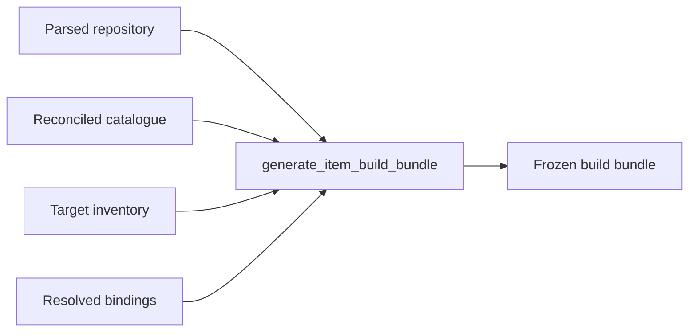
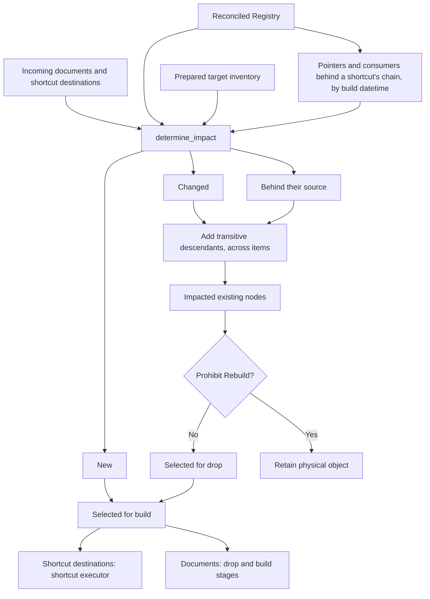
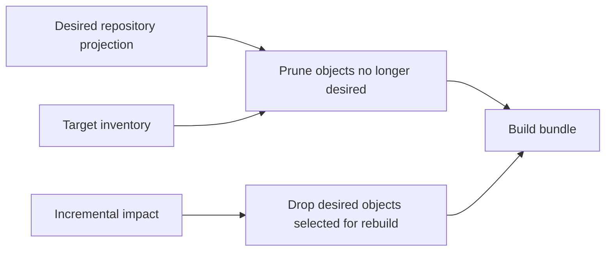
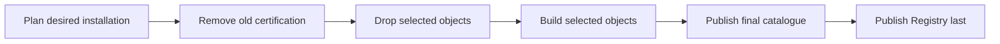

# How Weaver Build Works

## Purpose

This document explains the build lifecycle from repository input to installed
bundle. Build invariants are defined in [Build philosophy](build-philosophy.md).

## Status

This document describes the implemented build lifecycle. The contract-level
reasoning belongs in [Build philosophy](build-philosophy.md).

## 1. What Weaver build does

A Weaver repository declares the desired structure of a data estate. Build
turns that declaration into schemas, folders, Delta tables, Warehouse tables,
views, and the load artefacts that will one day fill them.

Build does not populate those objects with source data. It never calls an
object's `read()` implementation, samples operational input, executes merge
policy, or advances a bookmark. Those are load responsibilities.

It does *reset* a bookmark, which is the opposite decision — section 11d.

> Build creates and reconciles structure. Load moves and transforms data.

Installing an item's load *code* is on the build side of that line, and the
distinction is worth being exact about. A deployed Python module and a generated
stored procedure are objects that must exist before any load can run — they are
created, signed, reconciled and pruned exactly as a table is, and running them is
somebody else's job entirely. Section 11b describes them.

An empty table created from declared columns, or from the static shape of a
declared query, is a successful build. This boundary lets structure advance
independently of data processing.

## 2. Weaver documents and physical objects

Each object document belongs to one logical item:

```text
Lakehouse/Raw/Files/Sales.Export        -> folder
Lakehouse/Raw/Tables/Sales.Customer     -> Delta table or view
Warehouse/Reporting/Sales.Customer      -> Warehouse table or view
```

The canonical document identity is item plus schema plus object name, and a
Lakehouse one names the Fabric area it sits in: `Tables/` for a Table or a View,
`Files/` for a Folder. A Warehouse has no areas and names none. The item's type chooses the dialect and
materialisation form. Physical binding is separate: `Lakehouse/Raw` can be
bound to a differently named Lakehouse without changing its logical identity.

Structure comes from declarations, never from observed source rows. A Python
Delta table has declared columns. A SQL-backed table can derive columns from the
query's output types during its one self-contained build action. This is query
shape inference, not source-data inference: no rows are loaded and the action
cannot broaden its target.

Every generated object reference is resolved against the action's bound target,
producing the native workspace/Lakehouse/schema/object name. A bare
`Schema.Object` would inherit the session's attached Lakehouse and is therefore
not a valid physical binding.

## 3. Inputs prepared before bundle generation

The build workflow prepares four inputs before planning:



Repository parsing and request validation happen before any target inspection,
catalogue read, Fabric item resolution, or Livy session. The planner consumes
prepared state; it performs no external discovery. The installer later executes
only what the bundle contains.

In a native Fabric build, preparation, planning, and installation all run in the
target session; a remote repository is materialised once to driver-local storage.
For the desktop CLI targeting Fabric, the parsed local repository stays local:
Fabric returns a serialised `BuildState`, the desktop freezes the complete
bundle, and Fabric receives only that archive for installation.

## 4. Repository parsing and binding

Discovery reads and validates the complete repository without importing authored
Python modules. It establishes:

- canonical document and schema identities;
- metadata, shortcuts, and item ownership;
- dependency edges and deterministic graph layers;
- source hashes and effective build signatures;
- explicit physical bindings for every selected item.

Python import discovery is static. For a Python object, its effective signature
contains the object document and the exact transitive closure of Python helpers
it imports from that same item's `lib/` directory. Changing a reached helper
therefore changes the object; changing an unused helper does not. A reachable
helper that cannot be parsed fails discovery. Authored modules are never executed
to calculate this closure.

Discovery also derives an **item-level** dependency graph and its topological
layers. One item depends on another when one of its documents resolves to a
document that other item owns, or when it declares a shortcut whose target lives
there. Within-item edges do not appear: the document graph already orders those.

A circular item graph is a repository error, rejected while the whole declaration
is in view rather than at the point some incremental selection happens to exercise
it. A repository whose items cannot be ordered has no correct build, not merely no
correct build today. The parsed repository retains the resulting layers so every
later stage consumes one authoritative ordering rather than reconstructing one.

Cross-item dependencies are represented in both graphs, and impact crosses them.
The document graph carries logical shortcut destinations as nodes, so the path
from a producer to another item's consumer is an ordinary one:

```text
source document -> shortcut destination -> consumer document
```

Repository composition contributes the standard Weaver surface into this same
model before dependency resolution. A consuming item therefore holds ordinary
logical pairs such as:

```text
Warehouse/_weaver/_.Bookmark -> Warehouse/Reporting/_.Bookmark
Warehouse/_weaver/_.Log      -> Lakehouse/Sales/_.Log
```

Authored SQL that reads `_.Bookmark` resolves through the local destination, the
document and item graphs order the catalogue producer first, prune keeps the
destination, and physical planning renders that same pair as a Warehouse view or
Lakehouse shortcut. These are Weaver-owned declarations, and they publish the
same Shortcut producer pair and Registry certification as an authored one. A
later load therefore reconstructs the same relation from installed state that the
build resolved from the repository.

A changed object therefore expands to its descendants wherever they are, and the
planner needs no cross-item special case. Items *not* in the build are still
deferred, but by construction rather than by rule: they are not selected, so
nothing reaches them.

**A physical shortcut destination is not a node.** It names a Fabric item this
repository does not manage, which may have no producer here at all, so importing
one records a physical dependency and no graph edge. There is nothing in the
repository to order it against. The same is true of a schema shortcut, which
presents a namespace whose contents belong to the item it points at, and of a
runtime artefact, whose signature is its own content. All three are selected,
signed and registered, so more is selectable than the graph holds and the graph
is the only thing that can say which. See [§8](#8-impact-determination).

**The graph is not a projection of the published dependency rows.** `_.Dependency`
records what the author wrote and where it resolved to, so a shortcut edge names the
*source document* as its producer — that is the truth about lineage. The graph
answers what must be built and in what order, and there the shortcut destination is a
thing in its own right. The two are deliberately allowed to differ.

A same-item shortcut is rejected at parse. A shortcut exists to cross an item boundary;
within one item the document graph already orders producer before consumer, and
the shortcut stage runs ahead of every document an item declares, so a same-item
shortcut would be planned before its own source was built.

Bindings are typed. A Lakehouse item binds to a Lakehouse and a Warehouse item
binds to a Warehouse; Weaver never infers a destructive target from a bare
display name. The package-owned `Warehouse/_weaver` item is bound implicitly to
the mandatory catalogue Warehouse.

## 4a. Shortcuts

A shortcut is a consuming item's own name for something else: another Weaver
item's document, or a physical Fabric item Weaver does not manage. A Lakehouse
declares them in `shortcuts.py` and a Warehouse in `shortcuts.yml`. Either way the declaration is owned by the destination item, and
the source stays the canonical producer.

What a declaration becomes is a decision about the destination's target kind, and
is therefore made by the planner:

| Destination | Materialisation |
|---|---|
| Lakehouse | a OneLake shortcut, made over REST |
| Warehouse | a frozen `CREATE OR ALTER VIEW` over the source's three-part name |

Only the Warehouse form is spelled out in SQL, because there the statement is the
semantic decision. A shortcut carries one frozen decision, this destination and
that source, resolved at install time the same way a schema's `LOCATION` is.

`target_type` decides where the source address comes from. A **logical** declaration names
a Weaver-managed object—an authored document or a declared shortcut destination—
so the planner freezes the target's id and the installer resolves it through its
own environment, exactly as it resolves the destination. A
**physical** declaration names the Fabric item itself, possibly in another
workspace, which is not a target of this build. Its workspace id, item id and
case-exact source path are resolved while the estate is readable, before the
bundle is generated, and carried in the payload. Fabric validates a shortcut's
target when it is created and its paths are case-sensitive, so an address guessed
at install time fails rather than resolving to something else.

A `shortcut_type` decides both paths:

| Type | Destination | Source |
|---|---|---|
| `table` | `Tables/<schema>/<name>` | a table directory |
| `schema` | `Tables/<schema>` | a schema directory |
| `folder` | `Files/<schema>/<name>` | a path under `Files` |

**Weaver owns the shortcut root and nothing reachable through it.** OneLake makes
a shortcut a read-write window into the item it points at: writing beneath one
writes into that item, in that item's workspace, and deleting beneath one deletes
there. So nothing is ever planned inside a schema or folder shortcut, a repository
that declares something there is refused during discovery, and a wipe removes
shortcuts through the workspace before it sweeps storage. Removing the shortcut
root is safe, and it is the only thing Weaver does to one.

**Bound is two questions, and a shortcut source asks the second.**

```text
build binding      this build may modify the item
_.Installation     the item is already installed, and may be referenced
```

A logical shortcut's source is resolved in that order: the current build's
binding, then the item's `_.Installation` row, then nothing. An installed source
outside the build is read-only. It is declared among the plan's targets, because
the installer resolves a frozen source by target id, and it joins no build, drop
or prune scope. That is what lets a downstream item be rebuilt on its own without
naming every item upstream of it.

A selected declaration whose logical target item is resolved by neither, whose
destination and target disagree about the `Files`/table namespace, or whose direct
target did not resolve has no physical form under the current bindings. Bundle
generation fails before installation and names the unsupported shortcut. A
selected object owned by a bound item may never be omitted while the build reports
success.

An unchanged shortcut is not selected for materialisation. It is left installed
and certified even when its source item is outside the current build's bindings.
An object owned by an unbound item is outside the build's physical scope and may
still be recorded as `target_unbound` in the bundle's omissions.

Shortcut destinations join the prune keep-set, *all* of them and not only the ones a
build selected. They are desired state in the consuming item exactly as a declared
document is, merely produced elsewhere, so a build must not prune the shortcut or
view it is about to create, nor the one it just decided to keep. A shortcut holds
no data, so materialisation replaces rather than colliding: a build has to be able
to run twice. Prune is the repository-against-inventory diff and a declared
destination is never on the wrong side of it; what stands at a destination in the
wrong form is the managed drop's, below.

**A shortcut is an ordinary registered object, built incrementally.** It gets a
`_.Registry` row like any other, typed as what it physically is: a `folder` under
`Files`, a `view` in a Warehouse, a `table` in a Lakehouse, and `schema` for a
schema shortcut. There is no `shortcut` object *type*, because to a reader of the
catalogue a Lakehouse table shortcut is a table. What it is for is the object
*role*, which is `shortcut`, and where it points is `_.Shortcut`.

A schema shortcut is registered as the schema it presents and nothing inside it
is. Those objects belong to the item the shortcut points at, they can change
without a build, and enumerating them to decide what to remove would be deciding
about another item's estate.

Its signature is its declaration — this destination, that source — and nothing
about the source's content. A reloaded source does not redefine a shortcut, and
signing it with the source's hash would replace every downstream shortcut whenever
a table was rebuilt.

A shortcut is therefore rebuilt when it is new, when its declaration changed, when
its destination is missing from the target, or when the source under it was built
after it. That last one is a refresh: the pointer is materialised over the address
already there, never dropped and remade, because Fabric holds a deleted shortcut's
name for tens of seconds. A Lakehouse pointer goes through `CreateOrOverwrite` and
a Warehouse pointer through `create or alter view`. See
[§7a](#7a-cross-item-freshness).

It is materialised by the shortcut executor, never by the generic drop-and-build
pipeline: it holds no data, so it is replaced in place, and there is no source
document for a build stage to render.

### The declared form is what an identity is reconciled to

Replacing a pointer is the shortcut action's own business, so a destination
already installed as a pointer is never dropped first. What the pointer replaces
is decided from the role the `_.Registry` row carries, because a build is
reconciling one identity to the form now declared for it:

| Installed role | Now declared | What the build does first |
|---|---|---|
| `shortcut` | a shortcut | nothing; materialisation replaces the pointer |
| `data` | a shortcut | the managed drop removes the installed object |
| `shortcut` | a document | the managed drop unpicks the pointer |
| no row | a shortcut | nothing; the create reports the occupied name |

This is the general desired-state rule and not a shortcut rule. It is the same
managed drop a table-to-view change goes through, reading the installed role and
the inventory's installed type, and it runs in the drop phase, ahead of both the
shortcut phase and the build phase. A shortcut create over a name an ordinary
folder or table occupies returns a conflict from Fabric, so a native
`Files/ACQSC/HarmSurveyXlsx` left standing by an earlier build blocks the folder
shortcut now declared there.

An identity with no Registry row is left where it stands. Nothing certified it,
so what occupies the name is not this build's to remove.

#### One transition waits for OneLake

Removing a shortcut and creating an owned Folder or Table at the **same physical
identity** is the one case a build waits between two of its own actions:

```text
installed shortcut X
    remove the shortcut
    wait for OneLake to release the name
    create the native object at X
```

Fabric stops listing the shortcut promptly, and OneLake holds the namespace for
tens of seconds after that, so an immediate native create at the same path fails
and the same create succeeds later. The plan marks the one drop whose name it
reuses with `awaits_name_release`, and the shortcut executor polls the path until
it stops answering. Every name removed by that action is waited on together, so
several removals cost one release window. A spent wait returns rather than
raising: the create that follows reports the occupied name, which says more than a
timeout would.

Nothing else waits:

| Transition | Wait |
|---|---|
| shortcut -> owned object at the same identity | yes |
| shortcut -> shortcut | no; `CreateOrOverwrite` stands on the address |
| a shortcut removed and the name not reused | no |
| owned object -> owned object | no |

Unpicking a pointer goes through the shortcut API, as `drop_shortcut`, and never
through a Spark `DROP TABLE` or a directory removal: a OneLake shortcut is a
read-write window into the item it points at, so both of those would reach that
item's data. A Warehouse pointer is a view over the source's three-part name, and
`drop view` removes the local object and nothing else.

**One action materialises all of an item's shortcuts.** The cost of a shortcut is not
the create — that is about a second — but the wait after it, so N actions running
serially would pay N waits where one action that creates everything and then waits
pays roughly one. For a Warehouse the statements go in an ordered array run through
`tsql_batch`, one batch each, because T-SQL requires `CREATE VIEW` to be the first
statement in its batch and will reject two of them sharing one.

**A shortcut action is not finished until the shortcut can be read.** Fabric creates a
shortcut synchronously and discovers it asynchronously, and in between the
Lakehouse reports the name as neither a view nor a table. The action therefore
polls a real read of the shortcut before returning. Without that wait the barrier the
plan puts around the shortcut means nothing, and the failure surfaces in the next
item's DDL instead — which is where it did surface, in Fabric, before the wait
existed. Measured against a real workspace, the shortcut exists in about a second
and becomes readable 6–31 seconds later.

**A shortcut is repointed, not deleted and remade.** The create carries
`shortcutConflictPolicy=CreateOrOverwrite`, so one request makes a shortcut where
there is none and repoints one that is there. Under the default `Abort` policy a
create over a live name is a 409, and the name a delete released stays held for
up to thirty-five seconds afterwards, which is time a build would spend waiting
for Fabric to let go of a name it was about to reuse. Measured against a Fabric
tenant: an overwrite answers 200 in under a second.

**Which shortcuts an installation touches is settled before it runs.** A pointer
is created when it is new and repointed when the pair it declares changes. See
[§4a](#4a-shortcuts) and [§7a](#7a-cross-item-freshness).

## 5. Target inventory

Before planning, Weaver freezes one inventory for every bound target. A
Lakehouse inventory records manageable schemas, folders, Delta tables, and
views. A Warehouse inventory records user schemas, tables, and views.

The inventory has two jobs:

1. prove which catalogue claims still have physical support; and
2. show which physical objects are absent, desired, or orphaned.

Inventory is scoped to the bound item and target. Reserved system areas are not
manageable. Failure to prepare an inventory is a planning error even when prune
is disabled, because strict creation needs to distinguish an absent schema from
an unexpected collision.

Inventory is never re-read by the installer. This prevents a catalogue or
permission failure at execution time from widening a destructive operation.

## 6. Catalogue reconciliation

The central catalogue is authoritative for certified installations. Before
incremental selection, its rows are physically reconciled with the prepared
inventories. Claims disproved by physical state are represented as deletion DML
in the bundle's first phase.

Reconciliation fails closed. An unreadable or incomplete inventory does not mean
"nothing exists" and cannot authorize deletion. The reconciled Registry is the
trusted installed baseline used for signature comparison.

The catalogue is central rather than target-local. It records item identity,
bindings, metadata, dependencies, installation history, and Registry
certification for every selected object.

## 7. Signature comparison

For each incoming document in a bound item, Weaver compares its effective build
signature with the reconciled Registry row and its physical presence in the
prepared target inventory:

```text
absent from inventory                           -> new
present + no Registry row                       -> changed
present + different effective signature         -> changed
present + matching effective signature          -> unchanged
```

Repository defines the desired object and signature. Inventory defines physical
existence and the installed kind. Registry defines the last successfully
certified signature. A missing Registry row is not evidence of physical absence;
it is the ordinary state left when a build completed physical work but failed
before certification.

Signatures are content-derived. They do not use timestamps or mutable target
metadata. The comparison therefore produces the same decision from the same
repository and prepared catalogue state.

Schema declarations, notes, ETL metadata, and all other document content remain
part of the document signature. For Python objects, the reached item-local
helper closure extends it as described in section 4.

Removed documents are not incoming impact candidates. They are handled by prune.

An shortcut destination is compared the same way, against the signature of its own
declaration. See [§4a](#4a-shortcuts).

## 7a. Cross-item freshness

A signature says whether a *declaration* changed. It cannot say whether an object
was **rebuilt** — reloading a table changes no declaration — and that is exactly
what a consumer in another item needs to know about the thing behind its shortcut.

So every `_.Registry` row carries the build that published it. Registry
publication is Weaver's completion boundary — a row is written last, after
everything the object needed succeeded — so "when was this published" is "when was
this last built", and two rows can be ordered against each other.

The chain a logical shortcut forms is compared link by link:

```text
source  <=  pointer  <=  consumer
```

A pointer dated before its source is behind, and so is a consumer dated before
the pointer it stands on. Either one joins the impacted set, and the ordinary
descendant walk carries the rebuild on from there. `stale_through_shortcuts`
returns whichever of the two is behind.

Naming the pointer is what makes one build enough. A pointer refreshed over its
own address is decertified and republished like any other rebuilt object, so its
row is re-dated, and the walk down from it reaches its consumers in the same
pass. The build after that finds `source <= pointer <= consumer` and plans
nothing.

The second link carries its own case. A build that refreshed the pointer and then
stopped leaves a consumer behind a pointer that is now current, and the
consumer's own comparison against the pointer is what picks it up.

Same-build and cross-build reach the same place by different routes:

```text
source rebuilt in this build     the graph carries the change to the pointer
                                 and on to its consumers

source rebuilt by an earlier     the epochs identify the pointer, which is
build                            refreshed, and the walk from it carries on
```

This applies whether or not the producer is in the build. The descendant walk only
starts from a node whose declaration changed, and a producer rebuilt by some
earlier build is, to this one, entirely unchanged.

**Deferral falls out of it.** Build only the producer and nothing about the
consumer is touched: it keeps its old build datetime and stays behind until it is
next built, when the comparison selects it.

The build datetime is set on **insert and never on update**. Every rebuild reaches the
merge as an insert, because everything in `selected_for_build` has its Registry
claim deleted before any physical work. An update is therefore a row whose
projection moved while the object stood still, and dating it would claim a
rebuild that never happened.

The set that stops being certified is what the build **rebuilds**, not what it
drops. A pointer is refreshed over its own address without being dropped, and it
is decertified with everything else, which is what re-dates its row.

It is written as an `{{build_datetime}}` token resolved once per installation, not a
literal frozen at generation time and not `current_timestamp()`. A literal would
give the same repository different payload bytes every run and destroy bundle
identity; a clock call is read per statement, and one build publishes Registry
rows in several statements, so a shortcut and its source could be dated apart and
then order against each other. A row written before build datetimes existed reads as null,
which orders as older than any build datetime and is not compared against another null.

## 8. Impact determination

`determine_impact()` classifies incoming nodes and expands each changed existing
node through its transitive descendants:



The inspectable `Impact` records `new`, `changed`, and `impacted_descendants`.
Unchanged nodes are implicit rather than copied into the manifest.

An shortcut destination has no source document and therefore no `prohibit_rebuild`:
nothing an author writes can forbid replacing a pointer, because replacing one
destroys nothing.
`impacted` is a convenience view over changed physically existing roots plus
affected existing descendants; new objects stay separate because they need
creation but no managed drop.

Only descendants are added. Upstream dependencies are not rebuilt merely
because one of their consumers changed. Deterministic graph ordering is applied
after filtering to the selected subset.

**A changed identity carries impact only where the graph holds that identity.**
Impact propagates through the current repository graph, so graph membership is
what decides whether a changed root starts a walk. Membership is asked of the
graph rather than derived from a list of the kinds that are not nodes: a physical
shortcut destination, a schema shortcut and a runtime artefact are each
selectable without being one, and each ends a walk rather than starting one. The
same rule layers the managed drops, which order by whatever edges the graph holds
among the selection and stand the rest of it isolated.

## 9. Prohibit Rebuild

`Prohibit Rebuild` is applied after impact is known. For a physically existing
impacted document it suppresses the physical managed drop and physical rebuild.
The document remains visible in the impact result and in `plan.yml` under the
mandatory build selection.

This policy protects the existing data or physical object. It does not freeze
the authored declaration or the catalogue. Final dictionary rows, notes, ETL
metadata, dependency claims, installation records, and the Registry signature
advance to the incoming repository state even while the physical data and its
security remain unchanged.

A document absent from Registry is not necessarily physically new. If inventory
also says it is absent, Weaver builds it normally. If inventory says the protected
object is already present, Weaver classifies it as changed, retains it, and
republishes its catalogue claims. `Prohibit Rebuild` protects the physical object,
not Weaver's memory of it; losing or rebuilding the catalogue does not authorize
replacement.

In set terms:

```text
selected_for_drop  = impacted physical - prohibited physical
selected_for_build = new + selected_for_drop
```

The CLI needs no parallel policy surface. The complete decision is recorded in
the frozen plan.

## 10. Prune versus managed rebuild

Prune and managed rebuild are distinct reasons to remove an object:



Prune removes physical objects absent from the desired projection. This includes
both a formerly registered document removed from the repository and an
unregistered physical orphan. For a registered removed document, its catalogue
claims are dropped before its physical prune action. An orphan has no claims to
remove. Prune drops retain `IF EXISTS` because their contract is idempotent
reconciliation of undesired state.

For a name a document declares, prune compares the name rather than the name and
the kind. An object declared as a table and still held as a view is a kind
change, and the managed drop below removes it by its installed type.

Shortcut destinations are compared by kind, because no managed drop covers one. A
Warehouse shortcut is remade by `CREATE OR ALTER VIEW`, which cannot replace a
table, so a table standing at the shortcut's name is prune's to remove.

A managed drop removes a desired, installed object only because incremental
selection chose it for rebuild. Its catalogue claims are deleted first, then its
physical object is dropped strictly. Dependants drop before dependencies. The
installed type comes from target inventory, so a declaration that changed from a
view to a table drops the view that is physically present and builds the table
the repository declares. Registry participates only in signature comparison;
its remembered type cannot override physical reality.

## 11. Bundle generation

A bundle is the complete contract between planning and execution. It contains:

- bound target descriptors;
- the full build selection;
- ordered sequences, batches, and actions;
- exact DDL, DML, filesystem operations, and payload hashes;
- **what each target will hold afterwards** — the objects added and removed;
- the deterministic bundle identity and the signature of the source it was planned from;
- omitted nodes and reporting metadata.

Unchanged and prohibited existing documents emit no physical actions. New and
selected rebuild documents emit physical creation actions in forward dependency
order. Final catalogue publication is projected from every desired bound
document, not merely the physical build subset.

Planned creation is strict. Tables, views, and folders use plain create
semantics. Schemas are emitted only when inventory says they are absent, and are
then also created strictly. An unexpected collision proves the prepared state or
an earlier action was wrong and fails visibly. Managed drops are strict for the
same reason. Only prune remains idempotent.

Every plan carries mandatory `selection`. Deserialisation rejects a plan that
omits it.

Sequence numbers are assigned last, from the assembled plan, and are consecutive
from 1. Planning components return ordered logical stages and choose no numbers,
so nothing has to leave arithmetic headroom for a repository's dependency depth
and no phase can collide with a region another phase claimed. A number *describes*
the order the plan already has; it does not create it.

### 11a. What a build declares it will mean

The actions say what runs. `target_changes` says what it amounts to: per bound
target, the objects the build adds and removes, named as an inventory reports
them.

```text
remove  table   DWG.Legacy                <- prune-table-DWG.Legacy
add     table   DWG.Customer              <- object-DWG.Customer
add     file    _/Load/lib/dates.py       <- load-file-lib-dates.py
```

**Declared, not inferred.** The effect of an action *could* be derived —
`prune_schema` removes a schema, `write_file` adds a path — but that derivation
is a model of what executors do, living where no executor can correct it. It
drifts silently. Stating the effect where the action is rendered puts the two
statements in one function, which is where a disagreement is cheapest to notice.

**Checked, not trusted.** A summary the planner writes about its own plan proves
nothing on its own. Every change names the action that produces it, so a physical
action nothing declares and a declaration nothing performs both fail a test —
per item type, since the two physical sides emit different actions. Adding an
artefact type means emitting an action *and* a change; forget either and the
correspondence breaks.

It also gives a pruned object somewhere to be written down. A prune action
carries no `resource_node_id` — what it removes has no node in the repository,
which is why it is being pruned — so without this, what a prune destroys appears
only inside a frozen SQL payload.

The summary lives in the manifest and therefore in the bundle identity: the
summary a reviewer reads is the one the installation was certified with. A
sibling file outside the hash could be edited afterwards, which is exactly what
frozen payloads exist to prevent.

Applying it to a prepared inventory gives the state a build is aiming at, which
is what lets **"a build converges on what the source declares"** be asserted
without installing anything — from an empty target, from a damaged one, and from
a correct one after a source is deleted.

### 11b. Three seams

Generation and execution are reachable at three narrower points than "build a
bundle", each the lowest layer that can answer its own question:

```python
render_document_build_action(identity, source)   # one declaration -> one action
plan_item_build(repository, item=..., ...)       # one item's physical plan
execute_action(action, payload, context=...)     # one action -> one ActionResult
```

They are not a parallel path. The planner calls `plan_item_build`,
`item_build_stages` calls the renderer, and the installer and `execute_action`
share one execution routine — so what a caller reaches directly is exactly what a
whole build does.

`execute_action` is the one that changes what has to be paid for. Almost
everything an executor does is checkable without an engine: that the exact
statement arrives, that a logical name is resolved against the batch's
destination first, that a missing capability fails saying which, and that a
failure becomes a *result* rather than an exception. What remains for a real
workspace is narrow, and reaching it no longer costs a repository parse, a
catalogue read and an installation.

### 11c. Load artefacts

A load artefact is a target object, not a side effect of building one. It is
claimed during repository interpretation, registered in the catalogue, signed,
selected incrementally, installed by a physical action and pruned when the source
stops claiming it — the same machinery a table travels through.

Three of them, from three kinds of source:

```text
Warehouse/Reporting/Sales__Customer.sql      ->  _.[Load Sales.Customer]
Lakehouse/Sales/lib/dates.py                 ->  Files/_/Load/lib/dates.py
Lakehouse/Sales/Tables/Sales.OrderSummary.sql -> Files/_/Load/Tables/Sales__OrderSummary.py
```

The third is the one worth reading twice. A Spark SQL table is *compiled* into a
deployed `SparkSqlTable` module rather than into a load program of its own, so
it installs where a module installs, under the name a module is imported by, and
loads through the same `Table.load()` a Python-authored table does. What that
buys is that validation, rejection, fault tolerance, stability thresholds and
static behaviour exist once for Delta rather than once per authoring language.

A view produces nothing on either engine: its definition *is* its query, so there
is no work to schedule. A Python file produces *two* targets — the table or folder
it declares, and the module a load will import — and they are separate objects
because their target identities and roles differ.

The identity model does not change. Every object is a schema and an object inside
an item; what differs is the shape of those two parts, and that shape decides how
they are validated and spelled:

```text
DWG        + Customer             a table
_/Load/lib + dates.py             a deployed module
_          + Load Sales.Customer  a generated procedure
```

Nothing is encoded to fit table-style validation, so nothing has to be decoded to
be used: the Registry stores what the target actually calls the object.

**Signatures say what would make an artefact wrong.** A deployed module is signed
by its own bytes. A generated body is signed by the document it renders *plus* the
version of the generator that rendered it — `SPARK_LOAD_VERSION` and
`TSQL_LOAD_VERSION`, separate because the two generators evolve separately.
Raising one invalidates exactly the artefacts it renders. Neither
reaches `repository.signature`, which describes authored content.

Selection is per artefact and nothing else. Changing one module rebuilds that
module; adding one creates a claim; deleting one prunes the target file; renaming
one does both, with nothing needing to know the two are related. A load artefact
is deliberately **not** a node in the authored dependency graph — nothing depends
on a deployed module and it depends on nothing — so a changed upstream document
never redeploys an unchanged one.

**`_` is generated infrastructure, not a reserved word.** A Lakehouse item with
load code declares a folder `Files/_/Load`; a Warehouse item with load procedures
uses schema `_`. Both are projected as ordinary managed objects while the item has
artefacts, which means the ordinary keep-set, inventory and prune give them their
whole lifecycle — including removal, when the last artefact goes and the folder or
schema stops being projected. An ordinary item may not author into `_`, which is
the one name Weaver takes back.

Removal of the artefacts themselves is **claim-driven**: the previous Registry row
says what was installed and where. That is not a weakening of "prune is explicit"
— the removals are frozen into the bundle at generation time like every other
destructive action — it is the recognition that a deleted source leaves nothing
behind for a diff to notice.

> This branch establishes the lifecycle. The generated T-SQL and Spark SQL bodies
> are deterministic proxies, and the template versions exist so replacing them
> later invalidates precisely what changed.

### 11d. Runtime state

The catalogue's current-state tables — `_.Bookmark`, `_.LoadStatus`,
`_.TestStatus` — describe one object's *current physical incarnation*, and a build
ends that for anything it is replacing or no longer installing. One stage
invalidates all three, keeping the rows of objects this build still runs and is
not replacing:

```text
no longer declared, or no longer run       the object is going
dropped and rebuilt                        the incarnation is going
```

It runs **before any physical action**, and that ordering is the safety property.
An absent bookmark makes the next load read everything; one left in place over a
recreated table makes it read almost nothing. A build that fails in between
leaves work to repeat.

History is untouched. `_.Log` and `_.LoadStatistic` record what happened, and a
rebuild does not unhappen it.

The two populations are separate. A loadable object carries a bookmark and a load
status, and comes from the load artefacts the item installs — a Weaver-loadable
Table or Folder, never a view, a table declaring `Has load procedure: false`, a
runtime artefact, or a validation. A validation carries a test status, and comes
from the validation artefacts. So rebuilding a table says nothing about a
validation's status, and rebuilding the validation says nothing about a bookmark.

The stage carries the decision as **structured intent** — which table, and which
keyed rows — rather than as SQL. The installer renders one scoped DELETE per table
from it, and a `Catalogue` applies the same intent in memory, so what a build
decided about an object's operational state can be read without parsing DML. The
plan states the same decision beside the action, as `target_changes` states a
build's physical effect.

The action is emitted when a build acts rather than on every run, so an unchanged
repository still produces an empty bundle. Its scope is the items the build
reconciles. A catalogue without the tables gets them from this build — every build
binds the built-in item — and tables nothing could have written to have nothing to
invalidate.

A build also gives every target it installs something runnable into the
catalogue's runtime tables under their own names: views in a Warehouse, OneLake
shortcuts in a Lakehouse, rendered by the same code a declared shortcut is. One
action per target carries every reference it is missing. The action follows the
target's schema and authored-shortcut stages and precedes its document builds,
because building a table can execute authored SQL that reads one of those local
names. When the same bundle creates the catalogue tables, the injected dependency
on the built-in item puts them in an earlier item layer. The references are in the
prune keep-set, so they go when the item's last runnable object does.

## 12. Bundle execution order

A build is an ordered series of **item** builds. The item graph is the outer
structure; the document graph orders work inside each item:

```text
catalogue claim removal, when required
bookmark reconciliation, when the build acts

item layer 0
    producer item A
        prune, managed drops, schemas, shortcuts, documents, endpoint refresh, load
    independent producer item B
        prune, managed drops, schemas, shortcuts, documents, endpoint refresh, load

item layer 1
    consumer item C
        prune, managed drops, schemas, shortcuts, documents, endpoint refresh, load

final batched catalogue publication
```

Items in the same topological layer share their barriers — one batch each —
because nothing orders them against one another. Items in different layers never
do. That is the one invariant multi-item build rests on: no item in a later layer
begins before every item it reaches into has completed, endpoint included.

Within an item, prune and managed drops lead because they are the destructive
reconciliation of what is already there. Schemas precede shortcuts so a
Warehouse-backed shortcut has a schema to be created in, and shortcuts precede the
item's own documents so those are built against a namespace that already holds
what the item imports. The load layer closes the item: its artefacts depend on
the item's structure being finished, which is expressed by the layer being last
rather than by any edge, and nothing inside it is ordered against anything else
because nothing there runs.

Empty phases are omitted. Managed drops use reverse dependency layers; physical
builds use forward layers. A sequence is a barrier: later sequences do not begin
after a failed action.

### The SQL endpoint refresh

A Fabric Lakehouse presents its Delta tables twice: natively to Spark, and through
a SQL analytics endpoint whose metadata is synchronised behind the mutation rather
than with it. Everything that reads a Lakehouse *as SQL* — a Warehouse view over
another item, a report, a downstream shortcut — reads that endpoint.

So when an item's planned work mutates Delta, one refresh closes that item,
immediately after its physical work and before any dependent item starts. A
Warehouse item has no endpoint of its own to refresh, and an item whose only work
was a folder or a schema has changed nothing the endpoint describes.

The refresh is planned host-independently, like the rest of the bundle.

Nothing closes the build. Catalogue publication used to be followed by a refresh
of its own, because the catalogue was Delta and its next reader came through an
endpoint. It is a Warehouse now, written over TDS, and a committed row is
readable.

The installer validates bundle shape and payload hashes, resolves the already
bound targets in its own environment, executes actions, and writes the install
report. It does not parse source, inspect targets, reconstruct dependencies,
regenerate DDL, or broaden prune.

## 13. Catalogue certification

Registry publication is the final certification step. The governing invariant
is:



An object selected for managed rebuild, or a registered object selected for
prune, stops being certified before its physical removal. A rebuilt or newly
created object is certified only after physical installation and dictionary
publication succeed.

For a prohibited existing document there is no physical removal. Its incoming
catalogue projection, including its new effective signature, is deliberately
published with the rest of the desired repository.

## 14. Failure and recovery

Weaver fails before mutation where possible:

- invalid metadata, identity, helper imports, and document or item dependency
  cycles fail parsing;
- missing bindings or inventories fail planning;
- a selected shortcut the current bindings give no physical form fails planning;
- payload tampering fails bundle validation;
- unexpected create and managed-drop collisions fail execution;
- a shortcut that never becomes readable, or an endpoint refresh that settles as
  failed, fails its own action rather than the next item's;
- an action failure stops later dependency barriers and final certification.

The install report describes execution rather than intention: each action is
`succeeded`, `failed`, `skipped`, or otherwise explicitly accounted for. A
failed rebuild remains uncertified because Registry publication never runs.
Rerunning from freshly reconciled state produces a new plan appropriate to the
physical and catalogue state left by the failure.

Prune's `IF EXISTS` behavior makes recovery tolerant when an undesired object
has already disappeared. Managed rebuild is intentionally stricter because its
drop-and-create transition is a proof of expected installed state.

## 15. Determinism and frozen bundles

The same prepared logical input produces the same canonical payloads, ordering,
hashes, and bundle identity. Environment-specific execution spelling—such as a
Fabric four-part name or a local schema location—is resolved from the bound
target by the executor without changing the semantic choice frozen in the
payload.

The repository is interpreted once. After generation it can be unavailable and
the bundle remains independently installable. Installation must never reopen
authored source, import object modules, infer dependencies, inspect current
source data, dynamically decide prune, or treat payloads as semantic templates.

This gives one reviewable equality:

```text
what was interpreted
= what was reviewed
= what was approved
= what is executed
```

## 16. Related design

This document describes the build lifecycle. The invariants that constrain that
lifecycle, including frozen bundles, explicit binding, and prune behaviour, are
defined in [Build philosophy](build-philosophy.md).
