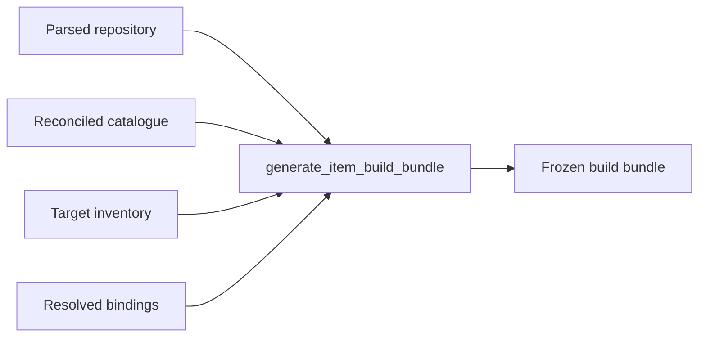
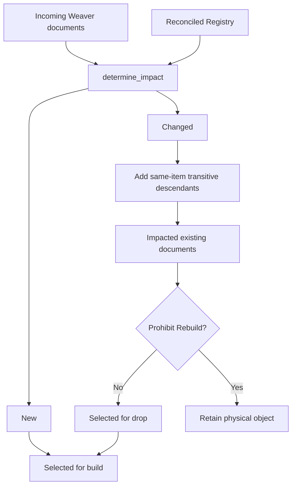
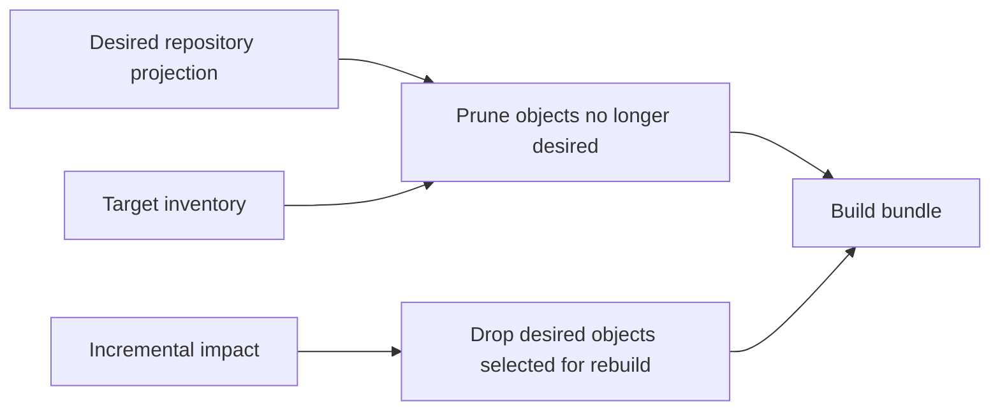
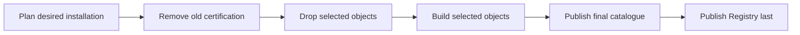

# How Weaver Build Works

## Status

This document describes the implemented Weaver build system. It combines the
mechanics of incremental planning with the architectural constraints that make a
bundle safe to inspect, move, and execute in both the local emulator and
Microsoft Fabric.

## 1. What Weaver build does

A Weaver repository declares the desired structure of a data estate. Build
turns that declaration into schemas, folders, Delta tables, Warehouse tables,
and views.

Build does not populate those objects with source data. It never calls an
object's `read()` implementation, samples operational input, executes merge
policy, or advances a bookmark. Those are load responsibilities.

> Build creates and reconciles structure. Load moves and transforms data.

An empty table created from declared columns, or from the static shape of a
declared query, is a successful build. This boundary lets structure advance
independently of data processing.

## 2. Weaver documents and physical objects

Each object document belongs to one logical item:

```text
Lakehouse/Raw/Files/Sales.Export       -> folder
Lakehouse/Raw/Sales.Customer           -> Delta table or view
Warehouse/Reporting/Sales.Customer     -> Warehouse table or view
```

The canonical document identity is item plus schema plus object name, including
the `Files/` namespace for folders. The item's type chooses the dialect and
materialisation form. Physical binding is separate: `Lakehouse/Raw` can be
bound to a differently named Lakehouse without changing its logical identity.

Structure comes from declarations, never from observed source rows. A Python
Delta table has declared columns. A SQL-backed table can derive columns from the
query's output types during its one self-contained build action. This is query
shape inference, not source-data inference: no rows are loaded and the action
cannot broaden its target.

Every generated object reference is resolved against the action's bound target.
On Fabric that produces the native workspace/Lakehouse/schema/object name. The
local emulator folds the Lakehouse into its namespace. A bare `Schema.Object`
would inherit the session's attached Lakehouse and is therefore not a valid
physical binding.

## 3. Inputs prepared before bundle generation

The build workflow prepares four inputs before planning:



Repository parsing, target inspection, catalogue reads, and name resolution all
happen before `generate_item_build_bundle`. The planner consumes prepared state;
it performs no external discovery. The installer later executes only what the
bundle contains.

In Fabric, both preparation and installation run in the target Fabric session.
The installed repository is materialised once to a driver-local directory for
static parsing. The desktop is not a hidden planning tier in the product path.

## 4. Repository parsing and binding

Discovery reads and validates the complete repository without importing authored
Python modules. It establishes:

- canonical document and schema identities;
- metadata, aliases, and item ownership;
- dependency edges and deterministic graph layers;
- source hashes and effective build signatures;
- explicit physical bindings for every selected item.

Python import discovery is static. For a Python object, its effective signature
contains the object document and the exact transitive closure of Python helpers
it imports from that same item's `lib/` directory. Changing a reached helper
therefore changes the object; changing an unused helper does not. A reachable
helper that cannot be parsed fails discovery. Authored modules are never executed
to calculate this closure.

Discovery also derives an **item-level** dependency graph and its topological
layers. One item depends on another when one of its documents resolves to a
document that other item owns, or when it declares an alias whose source lives
there. Within-item edges do not appear: the document graph already orders those.

A circular item graph is a repository error, rejected while the whole declaration
is in view rather than at the point some incremental selection happens to exercise
it. A repository whose items cannot be ordered has no correct build, not merely no
correct build today. The parsed repository retains the resulting layers so every
later stage consumes one authoritative ordering rather than reconstructing one.

Cross-item dependencies are represented in both graphs, but incremental *impact*
remains item-scoped. A changed object expands only to existing descendants in its
own item. Coordinated cross-item rebuild propagation is deliberately deferred;
cross-item *ordering* is not.

Bindings are typed. A Lakehouse item binds to a Lakehouse and a Warehouse item
binds to a Warehouse; Weaver never infers a destructive target from a bare
display name. The package-owned `Lakehouse/_weaver` item is bound implicitly to
the mandatory control Lakehouse.

## 4a. Aliases

An alias is a consuming item's own name for something another item produces. It
is declared in that item's `alias.yml`, is owned by the destination item, and
leaves the source as the canonical producer.

What an alias becomes is a decision about the destination's target kind, and is
therefore made by the planner:

| Destination | Materialisation |
|---|---|
| Lakehouse | a `create_alias` action — a OneLake shortcut in Fabric, a filesystem link plus catalogue registration in the emulator |
| Warehouse | a frozen view over the bound source's three-part name |

Only the Warehouse form is spelled out in SQL, because there the statement *is*
the semantic decision. A shortcut and a link are two transports for one frozen
decision — this destination, that source — resolved at install time the same way a
schema's `LOCATION` is.

An alias whose source item is not bound, or whose destination and source disagree
about the `Files`/table namespace, has no physical form under the current
bindings. It is omitted from the plan with the reason `alias_unsupported`. That
decision belongs to the planner; the installer may only run an alias action
already frozen for it.

Alias destinations join the prune keep-set. They are desired state in the
consuming item exactly as a declared document is — merely produced elsewhere — so
a build must not prune the shortcut or view it is about to create. An alias holds
no data, so materialisation replaces rather than colliding: a build has to be able
to run twice.

**An alias action is not finished until the alias can be read.** Fabric creates a
shortcut synchronously and discovers it asynchronously, and in between the
Lakehouse reports the name as neither a view nor a table. The action therefore
polls a real read of the alias before returning. Without that wait the barrier the
plan puts around the alias means nothing, and the failure surfaces in the next
item's DDL instead — which is where it did surface, in Fabric, before the wait
existed.

## 5. Target inventory

Before planning, Weaver freezes one inventory for every bound target. A
Lakehouse inventory records manageable schemas, folders, Delta tables, and
views. A Warehouse inventory records user schemas, tables, and views.

The inventory has two jobs:

1. prove which catalogue claims still have physical support; and
2. show which physical objects are absent, desired, or orphaned.

Inventory is scoped to the bound item and target. Reserved system areas are not
manageable. Failure to prepare an inventory is a planning error even when prune
is disabled, because strict creation needs to distinguish an absent schema from
an unexpected collision.

Inventory is never re-read by the installer. This prevents a catalogue or
permission failure at execution time from widening a destructive operation.

## 6. Catalogue reconciliation

The central catalogue is authoritative for certified installations. Before
incremental selection, its rows are physically reconciled with the prepared
inventories. Claims disproved by physical state are represented as deletion DML
in the bundle's first phase.

Reconciliation fails closed. An unreadable or incomplete inventory does not mean
"nothing exists" and cannot authorize deletion. The reconciled Registry is the
trusted installed baseline used for signature comparison.

The catalogue is central rather than target-local. It records item identity,
bindings, metadata, dependencies, installation history, and Registry
certification for every selected object.

## 7. Signature comparison

For each incoming document in a bound item, Weaver compares its effective build
signature with the reconciled Registry row:

```text
no Registry row                 -> new
different effective signature  -> changed
matching effective signature   -> unchanged
```

Signatures are content-derived. They do not use timestamps or mutable target
metadata. The comparison therefore produces the same decision from the same
repository and prepared catalogue state.

Schema declarations, notes, ETL metadata, and all other document content remain
part of the document signature. For Python objects, the reached item-local
helper closure extends it as described in section 4.

Removed documents are not incoming impact candidates. They are handled by prune.

## 8. Impact determination

`determine_impact()` classifies incoming documents and expands each changed
existing document through same-item transitive descendants:



The inspectable `Impact` records `new`, `changed`, and `impacted_descendants`.
Unchanged documents are implicit rather than copied into the manifest.
`impacted` is a convenience view over changed existing roots plus affected
existing descendants; new objects stay separate because they need creation but
no managed drop.

Only descendants are added. Upstream dependencies are not rebuilt merely
because one of their consumers changed. Deterministic graph ordering is applied
after filtering to the selected subset.

## 9. Prohibit Rebuild

`Prohibit Rebuild` is applied after logical impact is known. For an existing
impacted document it suppresses the physical managed drop and physical rebuild.
The document remains visible in the impact result and in `plan.yml` under the
mandatory build selection.

This policy protects the existing data or physical object. It does not freeze
the authored declaration or the catalogue. Final dictionary rows, notes, ETL
metadata, dependency claims, installation records, and the Registry signature
advance to the incoming repository state even while the physical data and its
security remain unchanged.

A new document marked `Prohibit Rebuild` is still built. There is no existing
installation to protect.

In set terms:

```text
selected_for_drop  = impacted existing - prohibited existing
selected_for_build = new + selected_for_drop
```

The CLI needs no parallel policy surface. The complete decision is recorded in
the frozen plan.

## 10. Prune versus managed rebuild

Prune and managed rebuild are distinct reasons to remove an object:



Prune removes physical objects absent from the desired projection. This includes
both a formerly registered document removed from the repository and an
unregistered physical orphan. For a registered removed document, its catalogue
claims are dropped before its physical prune action. An orphan has no claims to
remove. Prune drops retain `IF EXISTS` because their contract is idempotent
reconciliation of undesired state.

A managed drop removes a desired, installed object only because incremental
selection chose it for rebuild. Its catalogue claims are deleted first, then its
physical object is dropped strictly. Dependants drop before dependencies.

## 11. Bundle generation

A bundle is the complete contract between planning and execution. It contains:

- bound target descriptors;
- the full build selection;
- ordered sequences, batches, and actions;
- exact DDL, DML, filesystem operations, and payload hashes;
- the repository snapshot and deterministic bundle identity;
- omitted nodes and reporting metadata.

Unchanged and prohibited existing documents emit no physical actions. New and
selected rebuild documents emit physical creation actions in forward dependency
order. Final catalogue publication is projected from every desired bound
document, not merely the physical build subset.

Planned creation is strict. Tables, views, and folders use plain create
semantics. Schemas are emitted only when inventory says they are absent, and are
then also created strictly. An unexpected collision proves the prepared state or
an earlier action was wrong and fails visibly. Managed drops are strict for the
same reason. Only prune remains idempotent.

Every plan carries mandatory `selection`. Deserialisation rejects a plan that
omits it.

Sequence numbers are assigned last, from the assembled plan, and are consecutive
from 1. Planning components return ordered logical stages and choose no numbers,
so nothing has to leave arithmetic headroom for a repository's dependency depth
and no phase can collide with a region another phase claimed. A number *describes*
the order the plan already has; it does not create it.

## 12. Bundle execution order

A build is an ordered series of **item** builds. The item graph is the outer
structure; the document graph orders work inside each item:

```text
catalogue claim removal, when required

item layer 0
    producer item A
        prune, managed drops, schemas, aliases, documents, SQL endpoint refresh
    independent producer item B
        prune, managed drops, schemas, aliases, documents, SQL endpoint refresh

item layer 1
    consumer item C
        prune, managed drops, schemas, aliases, documents, SQL endpoint refresh

final batched catalogue publication
Weaver Lakehouse SQL endpoint refresh
```

Items in the same topological layer share their barriers — one batch each —
because nothing orders them against one another. Items in different layers never
do. That is the one invariant multi-item build rests on: no item in a later layer
begins before every item it reaches into has completed, endpoint included.

Within an item, prune and managed drops lead because they are the destructive
reconciliation of what is already there. Schemas precede aliases so a
Warehouse-backed alias has a schema to be created in, and aliases precede the
item's own documents so those are built against a namespace that already holds
what the item imports.

Empty phases are omitted. Managed drops use reverse dependency layers; physical
builds use forward layers. A sequence is a barrier: later sequences do not begin
after a failed action.

### The SQL endpoint refresh

A Fabric Lakehouse presents its Delta tables twice: natively to Spark, and through
a SQL analytics endpoint whose metadata is synchronised behind the mutation rather
than with it. Everything that reads a Lakehouse *as SQL* — a Warehouse view over
another item, a report, a downstream shortcut — reads that endpoint.

So when an item's planned work mutates Delta, one refresh closes that item,
immediately after its physical work and before any dependent item starts. A
Warehouse item has no endpoint of its own to refresh, and an item whose only work
was a folder or a schema has changed nothing the endpoint describes.

The refresh is planned host-independently, like the rest of the bundle. The local
emulator has no SQL analytics endpoint at all, and the executor says so and skips
rather than inventing a local equivalent that would keep no promise. The Weaver
Lakehouse's own refresh closes the build, after catalogue publication.

The installer validates bundle shape and payload hashes, resolves the already
bound targets in its own environment, executes actions, and writes the install
report. It does not parse source, inspect targets, reconstruct dependencies,
regenerate DDL, or broaden prune.

## 13. Catalogue certification

Registry publication is the final certification step. The governing invariant
is:



An object selected for managed rebuild, or a registered object selected for
prune, stops being certified before its physical removal. A rebuilt or newly
created object is certified only after physical installation and dictionary
publication succeed.

For a prohibited existing document there is no physical removal. Its incoming
catalogue projection, including its new effective signature, is deliberately
published with the rest of the desired repository.

## 14. Failure and recovery

Weaver fails before mutation where possible:

- invalid metadata, identity, helper imports, and document or item dependency
  cycles fail parsing;
- missing bindings or inventories fail planning;
- an alias the current bindings give no physical form is omitted at planning, with
  its reason recorded;
- payload tampering fails bundle validation;
- unexpected create and managed-drop collisions fail execution;
- an alias that never becomes readable, or an endpoint refresh that settles as
  failed, fails its own action rather than the next item's;
- an action failure stops later dependency barriers and final certification.

The install report describes execution rather than intention: each action is
`succeeded`, `failed`, `skipped`, or otherwise explicitly accounted for. A
failed rebuild remains uncertified because Registry publication never runs.
Rerunning from freshly reconciled state produces a new plan appropriate to the
physical and catalogue state left by the failure.

Prune's `IF EXISTS` behavior makes recovery tolerant when an undesired object
has already disappeared. Managed rebuild is intentionally stricter because its
drop-and-create transition is a proof of expected installed state.

## 15. Determinism and frozen bundles

The same prepared logical input produces the same canonical payloads, ordering,
hashes, and bundle identity. Environment-specific execution spelling—such as a
Fabric four-part name or a local schema location—is resolved from the bound
target by the executor without changing the semantic choice frozen in the
payload.

The repository is interpreted once. After generation it can be unavailable and
the bundle remains independently installable. Installation must never reopen
authored source, import object modules, infer dependencies, inspect current
source data, dynamically decide prune, or treat payloads as semantic templates.

This gives one reviewable equality:

```text
what was interpreted
= what was reviewed
= what was approved
= what is executed
```

## 16. Why Weaver works this way

Weaver is Fabric-first and keeps resource location separate from execution
location. Core code operates inside its environment: locally against the
emulator, or in a Fabric session against session-native stores and catalogues.
The same planned semantics are tested in both places.

The design condenses to these rules:

1. Build creates structure; load moves data.
2. Interpret the repository once and statically.
3. Prepare catalogue and target state before planning.
4. Make incremental selection visible in the plan.
5. Distinguish prune from a managed rebuild.
6. Remove certification before deliberate physical removal.
7. Use strict state transitions where the planner knows the expected state.
8. Bind every physical target explicitly.
9. Order items by the repository's item graph, and work within an item by its
   document graph.
10. Complete a mutated Lakehouse before anything depends on it.
11. Keep installation mechanical and unable to broaden scope.
12. Certify successful desired state last.

These constraints move risk earlier. They make consequential actions visible,
keep environment behavior comparable, and turn unexpected state into a clear
failure instead of a silent partial deployment.
